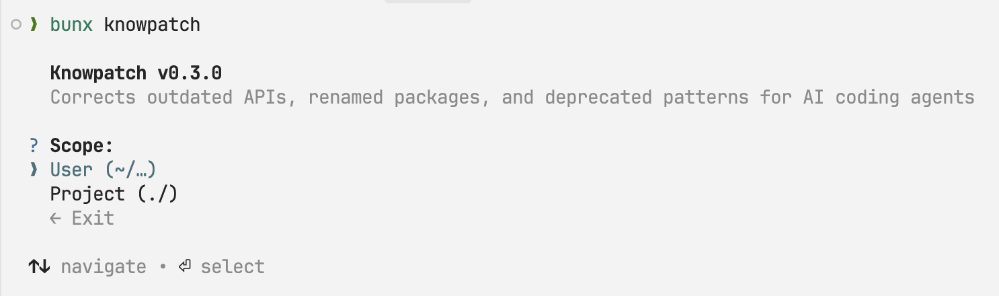

<!--
About
LLM knowledge cutoff compensator for AI coding agents — corrects outdated versions, deprecated APIs, renamed packages, and removed CLI commands

Topics
typescript bun cli claude-code codex gemini skill knowledge-cutoff llm version deprecated-api breaking-changes

Resources
-->

# knowpatch

LLM knowledge cutoff compensator for AI coding agents. Corrects outdated versions, deprecated APIs, renamed packages, and removed CLI commands — so your agent stops confidently using last year's code.

## Features

<table>
<tr>
<td><b>Knowledge Corrections</b><br>Renamed packages, changed APIs, new config formats, current model IDs</td>
<td><b>Detect Hook</b><br>Scans prompts and injects only relevant corrections automatically</td>
<td><b>Multi-Platform</b><br>Claude Code, Codex CLI, Gemini CLI from a single install</td>
</tr>
<tr>
<td><b>Version Verification</b><br>Never caches versions — always verified via package manager</td>
<td><b>Auto Update</b><br>Checks registry for new corrections on each run</td>
<td><b>Zero Config</b><br>One command to install, corrections work immediately</td>
</tr>
</table>

## Quick Start

```bash
npx knowpatch
```



Select platforms, done. Corrections start injecting into your agent automatically.

## How It Works

> **User prompt** → Detect hook scans keywords → Matches correction file tags → Injects relevant entries into agent context

The hook reads each prompt and matches against correction file tags. Only relevant entries are injected — not the entire correction set.

## What It Corrects

| File | Covers |
|------|--------|
| `frontier-models.md` | Claude, GPT, Gemini model IDs |
| `open-source-models.md` | Llama, Mistral, DeepSeek, Qwen, GLM, Kimi |
| `cli-tools.md` | shadcn, tailwind, eslint, vite |
| `frameworks.md` | Next.js, Svelte, Nuxt, Django, FastAPI |
| `javascript.md` | Zod, React, TypeScript |
| `python.md` | Pydantic, Ruff, uv, pip |
| `platforms.md` | Supabase, Vercel, Cloudflare |
| `runtimes.md` | Node.js, Bun, Deno, Python, macOS |

## CLI

Running `knowpatch` with no arguments opens an interactive menu. Subcommands are also available:

```bash
knowpatch install             # install skill + hook
knowpatch update              # sync installation, check for updates
knowpatch uninstall           # remove skill and hooks
```

<details>
<summary>Options</summary>
<br>

| Flag | Description |
|------|-------------|
| `--scope user\|project` | Installation scope (`~/` or `./`) |
| `--platforms claude,codex,gemini` | Target specific platforms |
| `--force` | Overwrite existing (install only) |
| `--reconfigure` | Re-select platforms (update only) |

</details>

## Development

```bash
bun install && bun run dev    # dev mode
bun run build                 # build
bun test                      # test
```

## License

MIT
